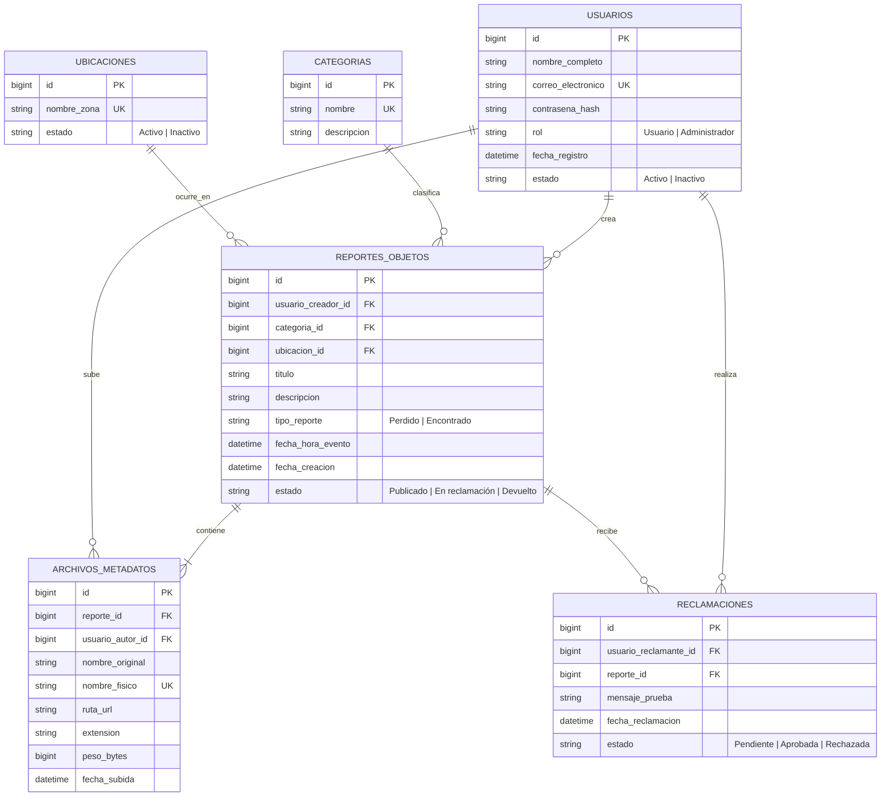

# Modelo entidad–relación · BuscaCampus

El universo del discurso es la gestión de objetos perdidos y encontrados dentro de la Universidad Autónoma de Occidente. Una persona registrada publica un reporte de pérdida o hallazgo en una zona del campus, lo clasifica y adjunta evidencia fotográfica. Otra persona puede presentar una reclamación con una prueba de propiedad. El archivo se conserva físicamente; sus datos descriptivos se guardan en PostgreSQL.

## Cardinalidades y reglas

Cada reporte requiere exactamente un autor, una categoría y una ubicación. Cada archivo tiene exactamente un reporte y un usuario que lo subió. Una reclamación corresponde exactamente a un usuario y un reporte. Las entidades padre pueden existir sin hijos. El reporte exige **al menos un archivo** según el MER, regla que deberá comprobar la operación de creación en una transacción porque una clave foránea por sí sola no la garantiza. Se permite una reclamación por usuario y reporte; su estado permite registrar la decisión. La contraseña se guarda como hash, nunca en texto claro.

El SQL ejecutable está en [`server/sql/schema.sql`](../server/sql/schema.sql). Los nombres en plural de tablas corresponden a las seis entidades del diagrama entregado. La categoría, la ubicación y la autoría del archivo se modelan como relaciones explícitas, a diferencia del borrador de tres entidades de la primera descripción.

